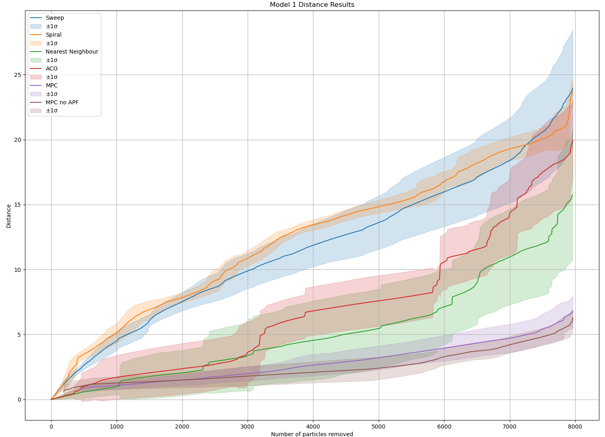
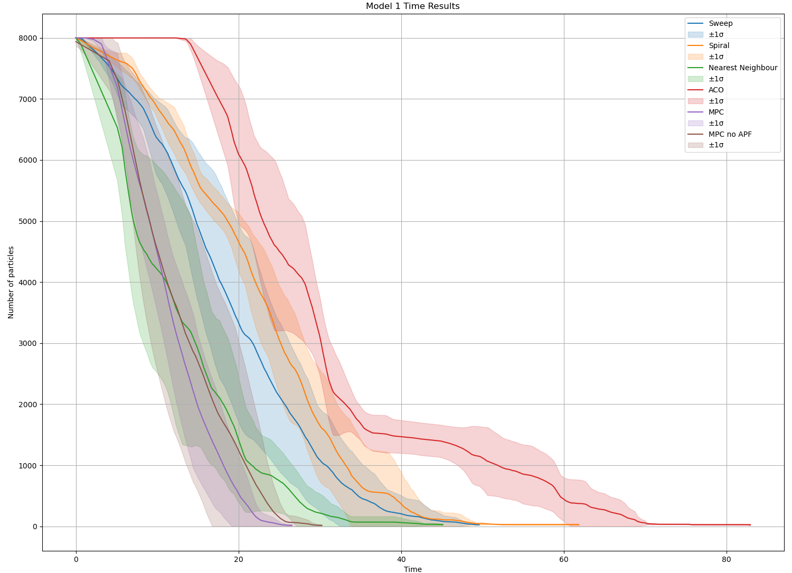

# Autonomous Blood Suction on the Da Vinci Surgical System

> A simulation-based study implementing computer vision and coverage path 
> planning for autonomous blood suction in robotic minimally invasive surgery,
> using the CRESSim and AMBF simulation environments.

---

## ⚠️ Repository Notice

This repository contains only the project-specific contributions developed 
as part of this study. The full simulation environments (CRESSim) 
and their associated dependencies are not included. The code is provided 
for display and review purposes.

---

## Project Overview

Minimally invasive surgery (MIS) reduces patient recovery time and surgical 
complications compared to open surgery. The da Vinci Surgical System is the 
most widely used robotic platform for MIS globally. Despite blood suction 
accounting for approximately 11% of surgical time in procedures such as 
prostatectomy, it remains one of the least automated surgical tasks.

This project implements a complete autonomous blood suction pipeline on the 
da Vinci Research Kit (dVRK) in simulation, consisting of two core 
components:

1. **Computer Vision** — A U-Net neural network for blood detection in 
   surgical scenes, alongside an HSV-based mask for simulation use.
2. **Coverage Path Planning** — Seven algorithms for generating complete 
   3D suction paths over detected blood pools.

---

## Key Results

| Component | Metric | Result |
|---|---|---|
| U-Net Blood Detection | F1 Score | 98% |
| U-Net Blood Detection | IoU Score | 71% |
| Best consistency across models | ACO | Most consistent distance |
| Best time/distance on dynamic pools | MPC | Most efficient when not in local minimum |
| Most practical for real-time use | Nearest Neighbour / Adaptive Nearest Neighbour | Fastest computation |

---

## Repository Structure

UNet.py: UNet architecture definition
Plots: Results for the path planners
Model1, Model2, Model3, Model4 and Model5: CSV recordings during runtime for each model
util/util: Contains all the algortihms for coverage path planning
node3.py: The file that uses the path planners and publishes control commands 
Models: Contains the files for the 3D models used in the simulation

---

## Technical Stack

| Category | Tools / Libraries |
|---|---|
| Language | Python 3.x |
| Deep Learning | TensorFlow |
| Computer Vision | OpenCV, NumPy |
| Simulation Communication | ROS / ROS2 |
| Robotics Platform | da Vinci Research Kit (dVRK) |
| Simulation Environments | AMBF, CRESSim (Unity) |
| Data | HemoSet Dataset |
| Visualisation | Matplotlib |

---

## Computer Vision

### U-Net Architecture
A lightweight U-Net convolutional neural network was implemented for 
blood segmentation in surgical scenes. The architecture consists of:

- Two downsampling steps via max pooling, doubling feature channels 
  at each step
- Corresponding upsampling steps with skip connections to preserve 
  spatial detail
- 11 convolutional layers in total
- Sigmoid activation on the final layer for binary classification

**Training Configuration:**
- Dataset: HemoSet (962 labelled images from live animal robotic surgery)
- Optimiser: Adam
- Loss Function: Binary Cross-Entropy
- Batch Size: 16
- Epochs: 15
- Train/Test Split: 80/20
- Input Resolution: 128×128 (grayscale)
- Detection Threshold: 50%

### HSV Mask
For use within the simulation environment, where the visual domain 
differs significantly from real surgical scenes, an HSV-based colour 
mask was implemented to detect blood against the light pink tissue 
background. This approach was selected over the U-Net for simulation 
use due to the domain gap between training data and simulation imagery.

---

## Coverage Path Planning

Seven algorithms were implemented to generate complete 3D suction paths 
over detected blood pools. All algorithms accept a binary blood mask 
and depth data as input and return an ordered sequence of 3D coordinates 
for the suction tool to follow.

### Algorithms

**Sweep Planner**
Boustrophedon (back-and-forth) sweep along the direction of minimum 
variance, determined via eigen decomposition of the blood pixel 
covariance matrix. Handles multiple blood pools by isolating contours.

**Spiral Planner**
Operates in polar coordinates centred on the blood pool centre of mass, 
sweeping inward from the outer boundary. Assumes the bleeding source 
is central, motivating an outside-in traversal.

**Nearest Neighbour**
Graph-based greedy algorithm treating blood pixels as TSP nodes after 
cell decomposition via average filtering to reduce computational 
complexity. Provides fast, sub-optimal paths suitable for real-time use.

**Adaptive Nearest Neighbour**
Adapts the Nearest Neighbour algorithm to only execute part of the path to adapt to changing blood pool shape between planning steps.

**Ant Colony Optimisation (ACO)**
Population-based global optimisation algorithm inspired by pheromone 
trail behaviour in ant colonies. Demonstrated the most consistent 
performance across all test geometries due to its global search 
capability.

**Model Predictive Control (MPC)**
Stochastic sampling-based controller that minimises a cost function 
over a finite time horizon, considering distance to blood targets, 
remaining blood quantity, and obstacle proximity. Adapts to changing 
blood pool shape between planning steps.

**MPC with Artificial Potential Fields (MPC-APF)**
Extension of MPC that biases the control sampling distribution using 
APF-derived attractive and repulsive forces, accelerating convergence 
toward targets while maintaining obstacle avoidance. 

### Evaluation

Algorithms were evaluated in CRESSim across five tissue models with 
five repeats each, measuring:
- Distance travelled by the suction arm
- Time to suction all blood particles
- Standard deviation across repeats (consistency)

Models were specifically designed to test known algorithmic weaknesses 
including symmetric geometries (local minimum susceptibility), flat 
surfaces (static blood), multiple separated pools, and U-shaped pools.

---

## Selected Results

The figure below shows distance and time results for the simple blood 
pool model. Full results across all five models are available in the 
`Plots/` directory.

### Key Findings

- **Global optimisation capability** is the most important property 
  for consistent performance across varying blood pool geometries, 
  as demonstrated by ACO's consistency.
- **Adaptability to dynamic blood pools** reduces unnecessary arm 
  movement and suction time, as demonstrated by MPC variants 
  outperforming static planners on non-flat surfaces.
- **Local minimum susceptibility** in MPC and MPC-APF requires escape 
  mechanisms for reliable performance in symmetric geometries.
- **Nearest Neighbour** offers the best trade-off between computation 
  speed and path quality for real-time deployment scenarios.

---

## Academic Context

This project was completed as part of MECH3890/3895 at the School of 
Mechanical Engineering, University of Leeds (2025–26).

The full technical report is available upon request.

---

## Contact

**Yahia Abuhelweh**  
Yahia.abuhilwa@gmail.com  

---

## Acknowledgements

This project was supervised by Dr Dominic Jones at the University of 
Leeds. The CRESSim simulation environment was developed by https://tbs-ualberta.github.io/CRESSim/ and modified by Dr Dominic Jones for this project. The HemoSet dataset was used for 
training and evaluation of the blood segmentation model.
